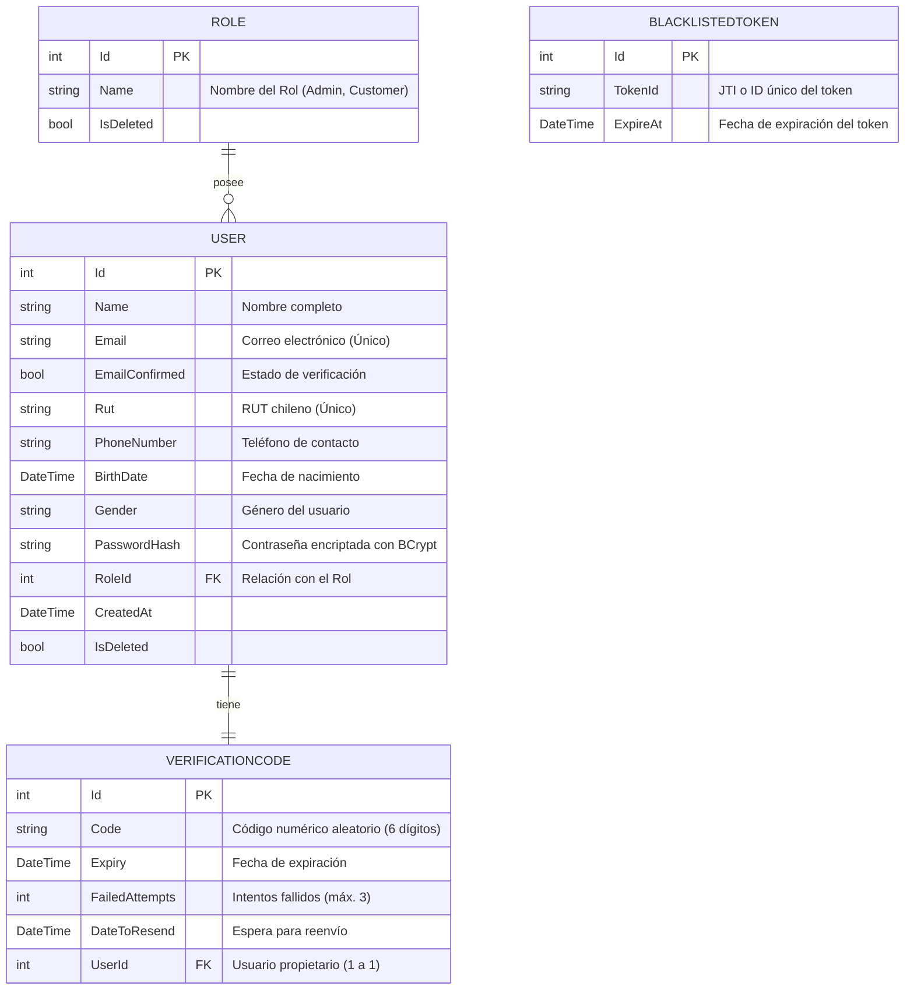
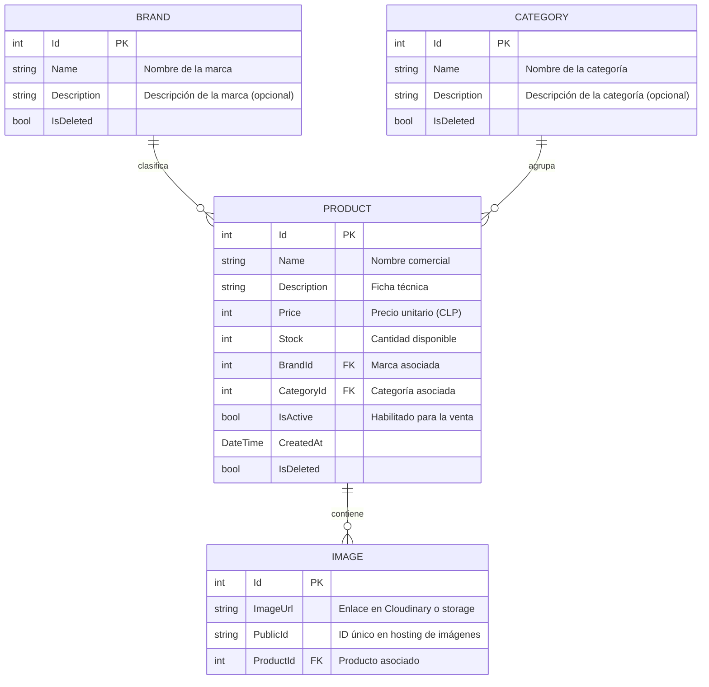
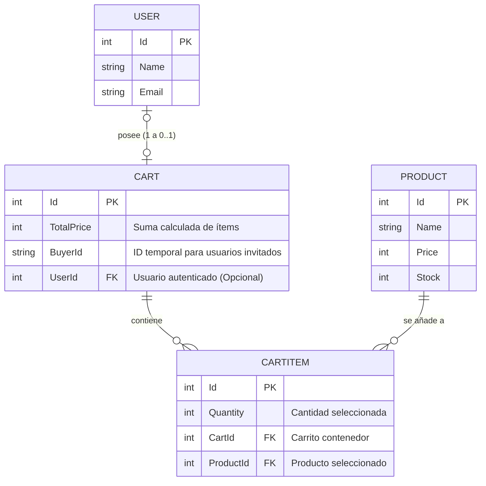
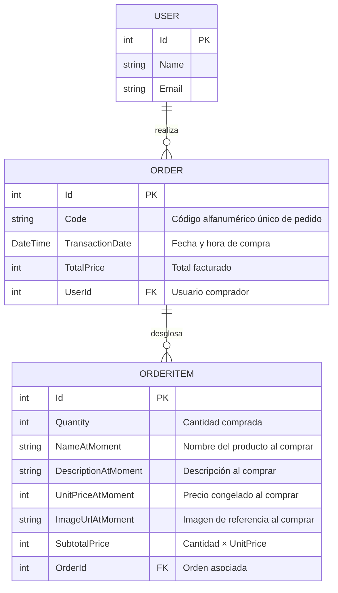
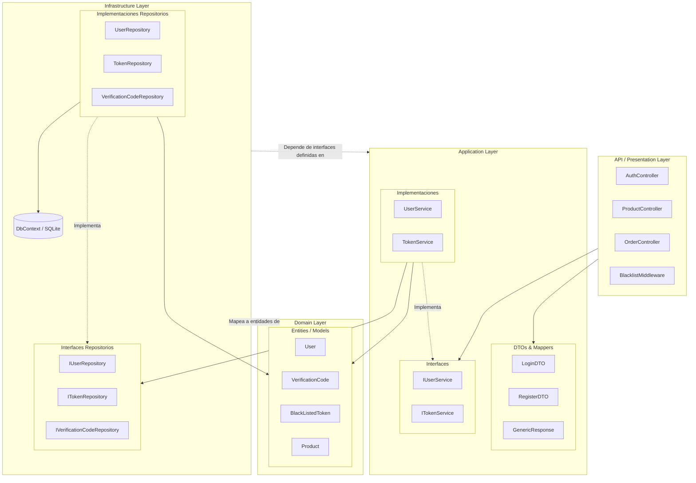

# 🏛️ Documentación de Arquitectura, Flujos y Diagrama de Clases - TiendaUCN

Este documento presenta una vista detallada de la arquitectura de la aplicación **TiendaUCN**, organizada según las recomendaciones de diseño y estructuración para evidenciar la separación de capas, flujos de datos específicos y la historia de las entidades de la base de datos.

---

## 💾 1. Modelo Relacional Segmentado por Historias de Entidades

En lugar de visualizar un diagrama gigante e incomprensible de una sola vez, dividimos el modelo relacional en cuatro historias lógicas que relatan cómo interactúan los usuarios, el catálogo, el carrito y las órdenes de compra.

```mermaid
%%{init: {'theme': 'dark', 'themeVariables': { 'primaryColor': '#1e1e2e', 'edgeLabelBackground':'#11111b', 'tertiaryColor': '#313244'}}}%%
```

### 👤 Historia A: Autenticación, Roles y Códigos de Verificación
*Relata cómo un usuario se registra con un rol específico, obtiene un código único para verificar su cuenta por correo, y cómo los tokens de sesión se invalidan al cerrar sesión.*



---

### 📦 Historia B: Catálogo de Productos e Imágenes
*Relata cómo se estructura el inventario de la tienda. Un producto pertenece a una marca y una categoría, y contiene una galería de imágenes para su exhibición.*



---

### 🛒 Historia C: El Carrito de Compras
*Relata cómo interactúa un cliente (autenticado o anónimo) con los productos que desea comprar antes de consolidar el pago.*



---

### 🧾 Historia D: Órdenes de Compra y Transacciones Históricas (Snapshots)
*Relata lo que ocurre cuando se procesa un pago. Se crea una orden con un código único de seguimiento y se congelan los datos de los productos comprados (nombre, precio, descripción) en el momento exacto de la venta para evitar que futuros cambios de precio alteren los registros históricos.*



---

## 🏛️ 2. Diagrama de Arquitectura General

La aplicación sigue el enfoque de **Clean Architecture / Hexagonal Architecture**, dividida en cuatro capas principales con flujo de dependencias unidireccional hacia adentro (las capas externas conocen a las internas, pero las internas nunca conocen a las externas).



---

## 🔄 3. Flujo Concreto de Ejecución (Controller → Service → Repository)

Para comprender la interacción del método **Login**, se detalla la secuencia de ejecución desde que el cliente realiza la petición HTTP POST hasta que se consulta la base de datos y se genera el token de seguridad.

```mermaid
sequenceDiagram
    autonumber
    actor Cliente as Cliente (App/Frontend)
    participant AuthCtrl as AuthController<br/>[API Layer]
    participant UserServ as UserService<br/>[Application Layer]
    participant UserRepo as UserRepository<br/>[Infrastructure Layer]
    participant TokenServ as TokenService<br/>[Application Layer]
    participant DB as SQLite DB

    Cliente->>AuthCtrl: POST /api/auth/login { Email, Password }
    Note over AuthCtrl: Recibe LoginDTO validado automáticamente por ASP.NET
    AuthCtrl->>UserServ: LoginAsync(loginDTO)
    
    rect rgb(30, 41, 59)
        Note over UserServ: Proceso del Caso de Uso: Login
        UserServ->>UserRepo: GetByEmailAsync(loginDTO.Email)
        UserRepo->>DB: SELECT * FROM Users WHERE Email = @Email
        DB-->>UserRepo: Registro del Usuario (incluyendo Rol)
        UserRepo-->>UserServ: Objeto User (o null)

        alt Usuario no existe o Credenciales Inválidas
            Note over UserServ: Lanza KeyNotFoundException("Credenciales invalidas")
            UserServ-->>AuthCtrl: Excepción
            AuthCtrl-->>Cliente: 404/400 Bad Request / Not Found
        end

        Note over UserServ: Verifica Hash de Contraseña usando BCrypt.Net.BCrypt.Verify(...)
        alt Contraseña incorrecta
            Note over UserServ: Lanza InvalidOperationException("Credenciales invalidas")
            UserServ-->>AuthCtrl: Excepción
            AuthCtrl-->>Cliente: 400 Bad Request
        end

        Note over UserServ: Valida si EmailConfirmed == true
        alt Email no confirmado
            Note over UserServ: Lanza InvalidOperationException("Credenciales invalidas...")
            UserServ-->>AuthCtrl: Excepción
            AuthCtrl-->>Cliente: 400 Bad Request
        end
    end

    rect rgb(15, 23, 42)
        Note over UserServ: Generación del Token JWT
        UserServ->>TokenServ: GenerateToken(user, user.Role.Name)
        Note over TokenServ: Agrega Claims (NameIdentifier, Email, Role, JTI)<br/>Firma con Clave Secreta (HMACSHA256)
        TokenServ-->>UserServ: Token JWT String
    end

    UserServ-->>AuthCtrl: Token JWT String
    Note over AuthCtrl: Envuelve el token en GenericResponse<string>
    AuthCtrl-->>Cliente: 200 OK { Success: true, Message: "Login exitoso", Data: "eyJhbGci..." }
```



---

## 📐 4. Diagrama de Clases Detallado con Mejoras de Diseño

A continuación, se presenta el diagrama de clases interactivo en Mermaid, incorporando de manera explícita todas las directrices encomendadas por Jorge:

1. **Atributos estrictamente privados** (`-`) en `AuthController` (ej. `_userService`).
2. **Parámetros y tipos de retorno explícitos** para el método `Login` de todas las capas.
3. **Estructura de campos de `LoginDTO`** con sus respectivos tipos y metadatos de validación.
4. **Documentación detallada en XML/texto** de los métodos clave de `TokenService`, `UserService` y los repositorios correspondientes.

```mermaid
classDiagram
    direction TB

    %% --- CONTROLADORES (API) ---
    class AuthController {
        - IUserService _userService
        + AuthController(userService: IUserService)
        + Register(registerDTO: RegisterDTO) Task~IActionResult~
        + EmailVerification(emailVerificationDTO: EmailVerificationDTO) Task~IActionResult~
        + Login(loginDTO: LoginDTO) Task~ActionResult~
        + ResendVerificationCode(resendVerificationCodeDTO: ResendVerificationCodeDTO) Task~IActionResult~
        + Logout() Task~IActionResult~
    }
    note for AuthController "OutController (AuthController) ahora declara explícitamente\nsus atributos privados y especifica la firma del Login."

    %% --- DTOs (APPLICATION) ---
    class LoginDTO {
        + string Email : Required, EmailAddress
        + string Password : Required
    }
    note for LoginDTO "Representa los datos requeridos para\nautenticarse en el sistema."

    %% --- SERVICIOS (APPLICATION INTERFACES) ---
    class IUserService {
        <<interface>>
        + RegisterAsync(registerDTO: RegisterDTO) Task~string~
        + EmailVerificationAsync(emailVerificationDTO: EmailVerificationDTO) Task~void~
        + LoginAsync(loginDTO: LoginDTO) Task~string~
        + LogoutAsync(token: string) Task~string~
        + DeleteUnconfirmedUsersAsync() Task~int~
        + ResendVerificationCodeAsync(resendVerificationCodeDTO: ResendVerificationCodeDTO) Task~string~
    }

    class ITokenService {
        <<interface>>
        + GenerateToken(user: User, roleName: string) string
        + AddToBlacklistAsync(token: string) Task~void~
        + IsTokenBlacklistedAsync(token: string) Task~bool~
        + DeleteExpiredTokensInBlacklistAsync() Task~int~
    }

    %% --- SERVICIOS IMPLEMENTACIONES (APPLICATION) ---
    class UserService {
        - IUserRepository _userRepository
        - IVerificationCodeRepository _verificationCodeRepository
        - IEmailService _emailService
        - IConfiguration _configuration
        - ITokenService _tokenService
        - int _verificationCodeExpiry
        - int _maxFailedEmailVerificationAttempts
        + UserService(emailService: IEmailService, userRepository: IUserRepository, verificationCodeRepository: IVerificationCodeRepository, configuration: IConfiguration, tokenService: ITokenService)
        + RegisterAsync(registerDTO: RegisterDTO) Task~string~
        + EmailVerificationAsync(emailVerificationDTO: EmailVerificationDTO) Task~void~
        + LoginAsync(loginDTO: LoginDTO) Task~string~
        + LogoutAsync(token: string) Task~string~
        + DeleteUnconfirmedUsersAsync() Task~int~
        + ResendVerificationCodeAsync(resendVerificationCodeDTO: ResendVerificationCodeDTO) Task~string~
        - GenerateCodeAndExpiryAsync() Task~Tuple~
    }
    note for UserService "Métodos Documentados:\n- RegisterAsync: Registra usuario, crea código de verificación y envía email.\n- EmailVerificationAsync: Confirma cuenta mediante código de 6 dígitos.\n- LoginAsync: Valida credenciales e email confirmado; retorna token JWT.\n- LogoutAsync: Agrega token a la blacklist para invalidar la sesión.\n- ResendVerificationCodeAsync: Reenvía el código si no ha expirado y esperó el cooldown."

    class TokenService {
        - string _jwtSecret
        - ITokenRepository _tokenRepository
        - IConfiguration _configuration
        - int _tokenExpirationInHours
        + TokenService(tokenRepository: ITokenRepository, configuration: IConfiguration)
        + GenerateToken(user: User, roleName: string) string
        + AddToBlacklistAsync(token: string) Task~void~
        + IsTokenBlacklistedAsync(token: string) Task~bool~
        + DeleteExpiredTokensInBlacklistAsync() Task~int~
    }
    note for TokenService "Métodos Documentados:\n- GenerateToken: Construye el JWT con Claims esenciales (Id, Email, Rol, JTI) y firma con HMACSHA256.\n- AddToBlacklistAsync: Extrae el JTI del token y lo almacena para invalidarlo tras logout.\n- IsTokenBlacklistedAsync: Verifica si el JTI del token se encuentra en la base de datos de blacklist.\n- DeleteExpiredTokensInBlacklistAsync: Tarea de limpieza cron que elimina tokens expirados de la blacklist."

    %% --- REPOSITORIOS (INFRASTRUCTURE INTERFACES) ---
    class IUserRepository {
        <<interface>>
        + ExistsByNameAsync(name: string) Task~bool~
        + ExistsByEmailAsync(email: string) Task~bool~
        + ExistsByRutAsync(rut: string) Task~bool~
        + ExistsByPhoneNumberAsync(phoneNumber: string) Task~bool~
        + CreateAsync(user: User) Task~void~
        + GetByEmailAsync(email: string) Task~User?~
        + MarkEmailAsVerifiedAsync(id: int) Task~bool~
        + DeleteUnconfirmedUsersAsync(daysToDeleteUnverifiedAccount: int) Task~int~
    }
    note for IUserRepository "Métodos Documentados:\n- ExistsByXXX: Validaciones de unicidad en BD.\n- CreateAsync: Inserta un nuevo usuario en estado pendiente.\n- GetByEmailAsync: Obtiene usuario con su respectivo Rol para login.\n- MarkEmailAsVerifiedAsync: Actualiza EmailConfirmed a verdadero.\n- DeleteUnconfirmedUsersAsync: Limpia cuentas no confirmadas obsoletas."

    class ITokenRepository {
        <<interface>>
        + AddAsync(token: BlackListedToken) Task~void~
        + IsBlacklistedAsync(tokenId: string) Task~bool~
        + DeleteExpiredTokensAsync() Task~int~
    }
    note for ITokenRepository "Métodos Documentados:\n- AddAsync: Inserta token invalidado en BD.\n- IsBlacklistedAsync: Busca token por JTI.\n- DeleteExpiredTokensAsync: Elimina tokens cuya expiración es menor a la fecha actual."

    class IVerificationCodeRepository {
        <<interface>>
        + CreateAsync(verificationCode: VerificationCode) Task~VerificationCode~
        + UpdateFailedAttemptsAsync(id: int) Task~bool~
        + UpdateAsync(id: int, code: string, expiry: DateTime) Task~bool~
        + UpdateDateToResendAsync(id: int, dateToResend: DateTime) Task~bool~
    }
    note for IVerificationCodeRepository "Métodos Documentados:\n- CreateAsync: Registra código inicial.\n- UpdateFailedAttemptsAsync: Incrementa el contador de intentos erróneos.\n- UpdateAsync: Sobrescribe el código y expiración en reenvíos.\n- UpdateDateToResendAsync: Establece el cooldown temporal de reenvío."

    %% --- RELACIONES ---
    AuthController --> IUserService : dependencias inyectadas
    AuthController ..> LoginDTO : recibe en login
    
    UserService ..|> IUserService : implementa
    UserService --> IUserRepository : consulta
    UserService --> IVerificationCodeRepository : consulta
    UserService --> ITokenService : utiliza para JWT

    TokenService ..|> ITokenService : implementa
    TokenService --> ITokenRepository : persiste blacklist

    UserRepository ..|> IUserRepository : implementa
    TokenRepository ..|> ITokenRepository : implementa
    VerificationCodeRepository ..|> IVerificationCodeRepository : implementa
