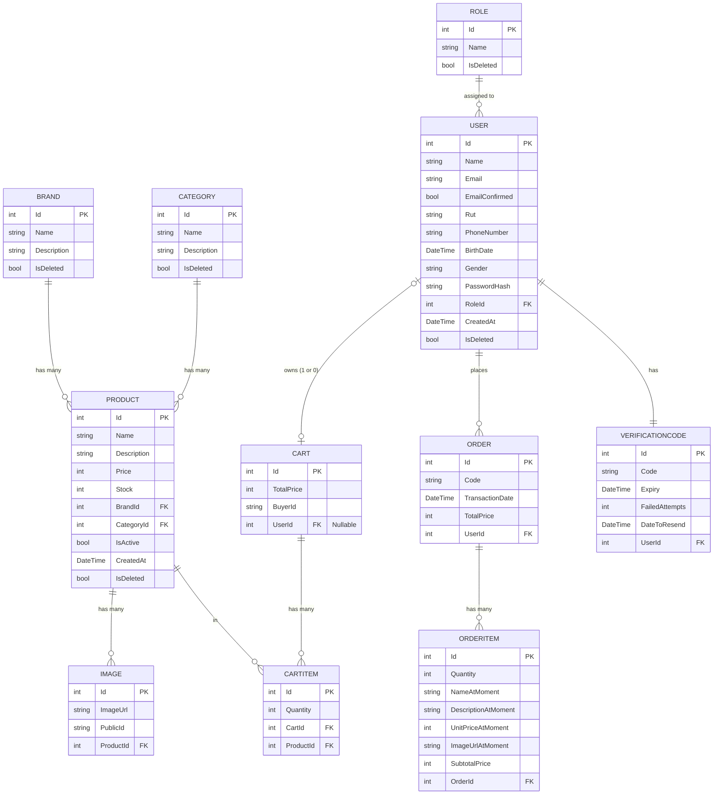

# Diagrama Entidad-Relación (ER) - TiendaUCN

A continuación se presenta el diagrama Entidad-Relación generado a partir de los modelos definidos en `src/Domain/Models` y `src/Domain/Product`.

## Detalles de las Relaciones
- **Product & Brand / Category**: Un `Product` pertenece a una única `Brand` y a una única `Category`. Una `Brand` o `Category` puede tener muchos `Product`.
- **Product & Image**: Un `Product` puede tener muchas `Image`.
- **Cart & CartItem**: Un `Cart` contiene muchos `CartItem`.
- **CartItem & Product**: Un `CartItem` hace referencia a un `Product`.
- **User & Cart**: Un `User` puede tener asociado un `Cart` (la relación es opcional del lado del carrito usando `UserId` nullable o `BuyerId` para no autenticados).
- **Order & OrderItem**: Una `Order` contiene múltiples `OrderItem`. Los `OrderItem` guardan un *snapshot* de los datos del producto al momento de la compra (nombre, precio, etc.).
- **User & Order**: Un `User` puede tener muchas `Order`.
- **User & Role**: Un `User` tiene un `Role`. Un `Role` puede ser asignado a muchos `User`.
- **User & VerificationCode**: Un `User` tiene asociado un `VerificationCode` para procesos como la validación del correo electrónico.
